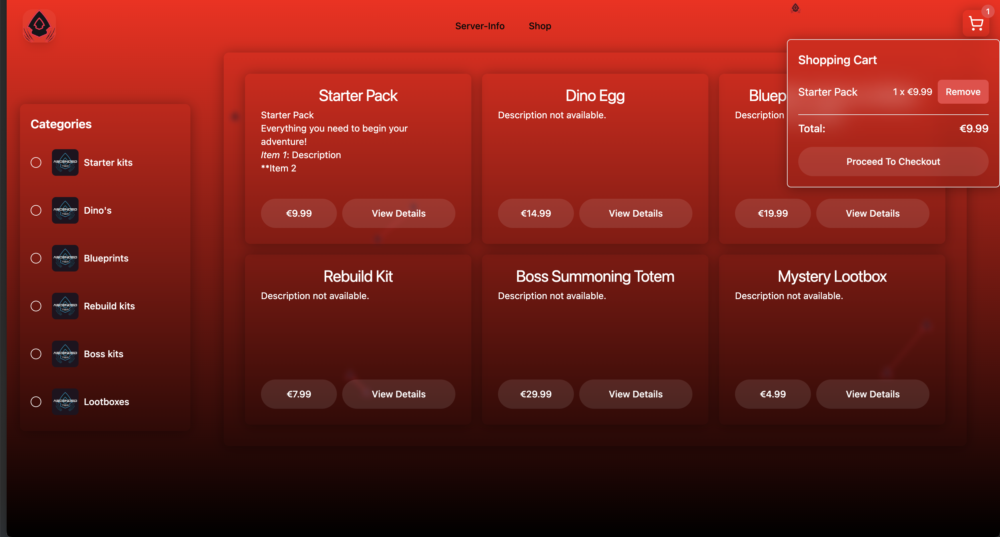

# Webpage for my ARK Server
```
 - Next.js *v14.2*, Using Typescript & App-router
 - This project uses [shadCN](ui.shadcn.com) and SASS for styling.
```
[Join Our Discord Server](https://discord.gg/46cJAE9z4h)

This project includes:
- [Stripe](https://docs.stripe.com/api) payment processing
- Buyable kits, automatically assigned to players through [RCON](https://www.npmjs.com/package/rcon-client) using the [ARKShop Plugin](https://ark-server-api.com/resources/asa-arkshop.34/) and the [ARK Server API](https://ark-server-api.com/) **WIP***
- Server Info display, such as Server-IP, Player Count (using [RCON](https://www.npmjs.com/package/rcon-client)), and Rules 
- Collapsable Navbar
- Particles Background using [TsParticles](https://particles.js.org/)
- [Supabase](https://supabase.com/) for oAuth and database storage **WIP***


Homepage Using [TsParticles](https://particles.js.org/) for the background


Shop route using [Stripe](https://docs.stripe.com/api), with a working shopping cart.

**Work In Progress*